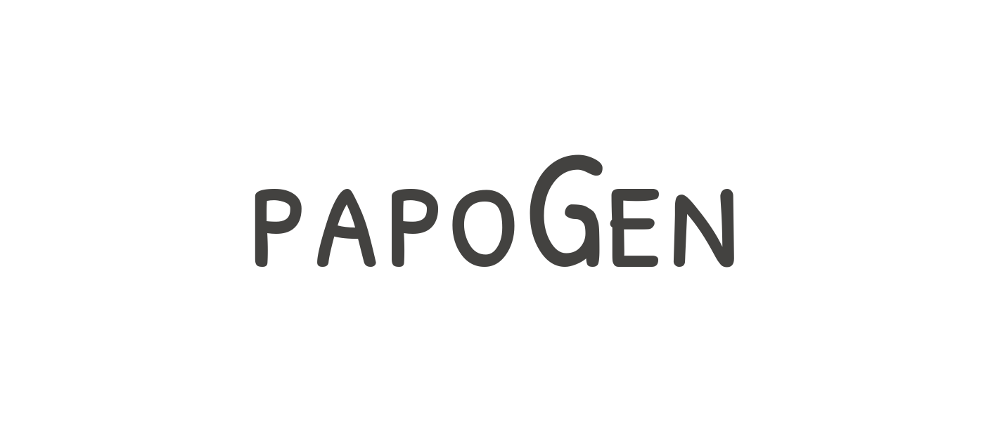

# papoGen
[](https://badge.fury.io/js/papogen)
[](https://www.npmjs.com/package/papogen)

Let's *papoGen* now!
*papoGen* - Quickly generate your webpage without too much web development experience!
If you feel *papoGen* is good, hope you can give a `star`!

---
## About

*papoGen* is a static webpage generator. To generate a webpage, you won't need to have web development experience. Only need do is know the format of Markdown, JSON, and YAML. Then you can generate your own webpage by our pre-defined templates. Besides, if you want to design your own style of web page, you can also develop your own template by *papoGen* without having too much time. *papoGen* is developed by [*Toolbuddy*](https://github.com/toolbuddy). If you have like *papoGen* or our other tools, please give us a "star"! If you have any problem or suggestion, please feel free to contact us. We'd love to help you.

---
## Usage

> [使用說明 - 中文詳細版本](example/)

1. **Installation**
    ```bash
    » [sudo] npm install papogen -g
    ```
    * Helping Manual
        * Explain each parameter we support currently!
        * See more in [here](https://github.com/toolbuddy/papoGen/blob/master/example/README.md).
2. **Generation**
    ```bash
    » papogen -s test/ -o docs/ -t papoGen -m doc
    ```

---
## Description

* The [*papoGen* document (i.e., DEMO page)](https://toolbuddy.github.io/papoGen/) is generated by *papoGen*!
    * Use JSON files under the folder `test/`
        * In `test/`, there are several categories of scripts, which are in their own directory.
        * Besides, `README.md` in their directory explains the format we supported.
    * View more:
        * [doc page](https://toolbuddy.github.io/papoGen/)
        * [resume page](https://toolbuddy.github.io/papoGen/resume)
* Generated by *script template*
    * Use `-h` to list the last part of all supporting scripts.
    * Use `papogen -c <script>/<format_1>/<format_2>/... -o <output>` to generate our template file.
        * `<script>` is the blue one. (in `-h` output message)
        * `<format>` is the grey one. (in `-h` output message)
            * Version after `0.0.12` support several templates specified by using `/` to separate each format.
            * You can use `json/all` to get all currently supported copy to target the output directory.
* Check our `example/` to see more!

---
## *papoGen* Commands

* Command Format
	```bash
	» papogen -s [--src] <src_path> \
            -o [--out] <out_path> \
            -t [--title] <title> \
            -g [--gen] <type> \
            -m [--model] <name> \
            --theme <theme> \
	        -h [--help]
	```

    | Option | Value | Description |
    |---|---|---|
    | `-s [--src]` | URL | The URL of the source files' folder |
    | `-o [--out]` | URL | The URL of the destination files' folder |
    | `-t [--title]` | STRING | The title you want to show on webpage |
    | `-g [--gen]` | `md` / `json` / `yaml` | The type of your source files |
    | `-m [--model]` | `md_doc`* / `doc` / `resume` / `papogen`+ | The web template you want to generate |
    | `--theme` | `paper`# / `papogen`+ | The theme you want to render on your wabpage |
    | `-h [--help]` | NONE | Show *papoGen* helping manual |
    
    * `md_doc`*: The only model supports Markdown.
    * `paper`#: Default theme
    * `papogen`+: The only theme supports `papogen` template. Notice that if you have already given the template as `papogen` (i.e., `-m papogen`), we will also set the theme as `papogen` (i.e., `--theme papogen`) automatically.

### Format: Markdown (Recommended!)

* Use Markdown format as configuration
* Different from the following format
* Generate from the file in Markdown directly
* Support multiple Markdown files as input
* Supporting model: `md_doc`
* Example command
    ```bash
    » papogen -s test/md -o docs/md -g md -m md_doc -t Graph\ Theory
    ```

### Format: JSON (Default)

* Use JSON format as configuration.
* Example command: See more in [here](https://github.com/toolbuddy/papoGen/blob/master/test/json/README.md).
    ```bash
    # Use directly (from source code)
    » node main.js -s test/ -o docs/ -t papoGen
    # By installation
    » papogen -s test/ -o docs/ -t papoGen -m doc
    ```

* After specifying the `src` directory, *PaperCSS* will fetch all the JSON files under `src`, and use the *filename* for each as "tag" in output.
* *papoGen* will base on the specified format to generate your content (see more detail below)
    * Currently support: `text` (see the source directory: `test/` as input, and destination directory: `docs/` as output)

### Format: YAML

* Use YAML format as configuration.
* Some formats are defined in [JSON](https://github.com/toolbuddy/papoGen/blob/master/test/json/README.md).
* Example command:
    ```bash
    # Use directly (from source code)
    » node main.js -s test/ -o docs/ -g yaml -t papoGen
    # By installation
    » papogen -s test/ -o docs/ -t papoGen -m doc -g yaml
    ```

* After specifying the `src/` directory, *PaperCSS* will fetch all files in JSON format under `src/`, and use the *filename* for each as "tag" in output.
* *papoGen* will base on the specified format to generate content (see more detail below)
    * Currently support: `text` (see the source directory: `test/` as input, and destination directory: `docs/` as output)

---
## DEMO

* Example( *中文介紹* ) - 2018 `Digital Ocean Meetup`, 2018 `ModernWeb`
   * [papoGen - 使用說明 ](https://github.com/yungshenglu/papoGen-demo)
* Example: Generated by *papoGen* format
   * [JSON - doc](https://toolbuddy.github.io/papoGen/out/doc)
   * [JSON - resume](https://toolbuddy.github.io/papoGen/out/resume/)
   * [JSON - papogen](https://toolbuddy.github.io/papoGen/out/papogen/)
   * [YAML - doc](https://toolbuddy.github.io/papoGen/out/doc)
   * [YAML - resume](https://toolbuddy.github.io/papoGen/out/resume/)
* Example: Generated directly from **Markdown** format
   * [From Markdown - md_doc](https://toolbuddy.github.io/papoGen/out/md/)
       * Support "MathJax" & "Table of content"!
   * Graph Theory Tutorial:
      * [ch3](https://toolbuddy.github.io/Graph-Theory/matching-factor/index.html)
      * [ch4](https://toolbuddy.github.io/Graph-Theory/connectivity-path/)
   * [simulation project - 802.11 wireless illustration](https://kevinbird61.github.io/simulation-wireless-802.11/)
   * [gRPC practice & learn](https://kevinbird61.github.io/grpc-practice/)

---
## *papoGen* Wiki

For more information about *papoGen*, you can refer our [wiki](https://github.com/toolbuddy/papoGen/wiki) in this repository.

### CHANGELOG

* See [here](https://github.com/toolbuddy/papoGen/wiki).
* Screenshot

    | Version | Table of Vontent | Main Page |
    | ------- | ------- | ------- |
    | `v0.2.2` |  |  |  

### Workflow

* See [here](https://github.com/toolbuddy/papoGen/wiki)

---
## WIP

If you want to contribute *papoGen*, use `git clone` with `--recursive` to clone the entire project. (or using `git submodule update` to update your old version.)

* [papoGen.css](https://github.com/toolbuddy/papoGen.css)
    * Our new web UI - *papoGen.css* is creating now!
    * Introduce a new theme and template into `papoGen`.

---
## Authors

* [Kevin Cyu](https://github.com/kevinbird61), kevinbird61@gmail.com
* [David Lu](https://github.com/yungshenglu), yungshenglu1994@gmail.com
