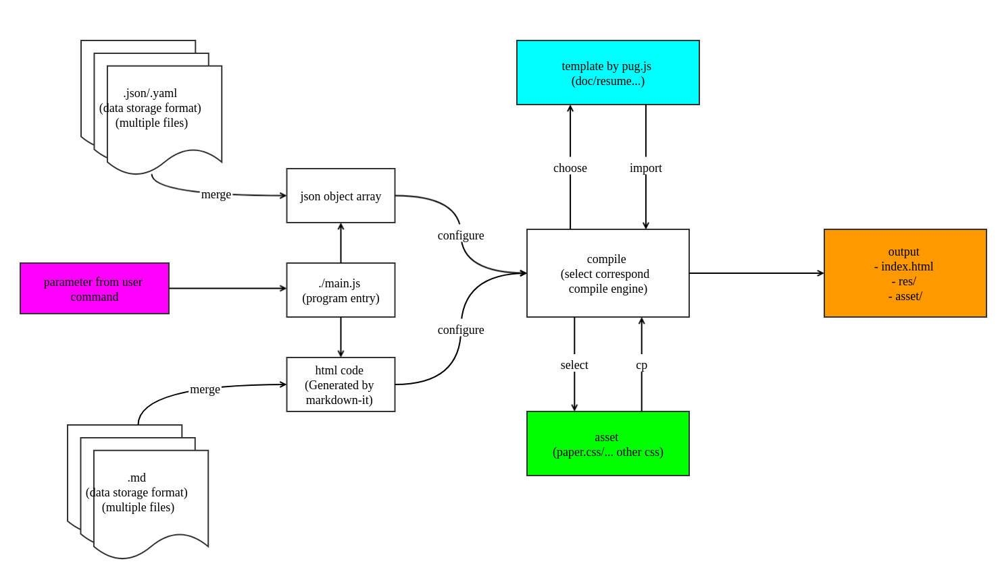

# papoGen
[](https://badge.fury.io/js/papogen)
[](https://img.shields.io/npm/dm/papogen.svg)

Using paper.css and pug.js to generate.

If you feel `papogen` is good, hope you can give a `star`!

# usage

* Install 
```bash
» [sudo] npm install papogen -g
```

* Help Manual (List out current support)
    * Explain each parameter we support currently!
```bash
~/workspace » papogen -h
Welcome using toolbuddy@papoGen!
Current version: 0.0.13

Usage:
papogen -s[--src] <src_path> -o[--out] <out_path> -t[--title] <title> -g[--gen] <type> -m[--model] <name> -h[--help]
     -s[--src] : specify the source files directory(using multiple configure files)
     -o[--out] : specify the output destination directory(will generate website for u!)
     -t[--title] : specify the title name of your website
     -g[--gen] : specify the generating mechanism of result, user can pick from several types. default value is "json"
     -m[--model] : specify the model/template of result
     -h : list out usage of papoGen
 =====================================

Optional usage:
papogen -c[--create] <script/format> -o[--out] <out_path>
    -c[--create] : generate template by command, with -o to specify output directory
        (Generation will terminate the program after it finished)
 =====================================

Usage/Detail of papoGen:
     default value of each parameter:
         src: current working directory
         out: current working directory
         title: "Powered by papoGen"
         gen: "json"
         model: "doc"
 =====================================
 If specified "-h" in command, then program will only list out usage, without any generation.

List all template support by papoGen:
        doc
        resume
List all script support by papoGen:
 (You can use command "papogen -c <script>/<format> -o <output>" to generate script template files)
        json
         - code
         - formula
         - hyper
         - image
         - list
         - table
         - text
        yaml
         - code
         - formula
         - hyper
         - image
         - list
         - table
         - text
```

* Generate
```bash
» papogen -s test/ -o docs/ -t papoGen -m doc
```

* Our document [demo page](https://toolbuddy.github.io/papoGen/), is generate by `papoGen`!
    * Using the json files in test/ 
        * In test/, there are several categories of scripts, each one has a directory
        * And there have a `README.md` inside each directory, explain the format of each type.
    * View more:
        * [doc page](https://toolbuddy.github.io/papoGen/)
        * [resume page](https://toolbuddy.github.io/papoGen/resume)

* Generate script template
    * After you using `-h` to list, you can see the last part of all script support.
    * And you can using `papogen -c <script>/<format_1>/<format_2>/... -o <output>` to generate our template file.
        * `<script>` is the blue one. (in `-h` output message)
        * `<format>` is the grey one. (in `-h` output message)
            * version after `0.0.12` support several template specified, use `/` to separate each format.
            * or you can just using `json/all` to get all current support copy to target output directory

* Check our `example/` to see more!

## json(default)
* Example command:
```bash
# Use directly (from source code)
» node main.js -s test/ -o docs/ -t papoGen
# By install 
» papogen -s test/ -o docs/ -t papoGen -m doc
```
* Using `json` as configuration.
* After specify the `src` directory, paperUI will fetch all .json under `src`, and using each *filename* to be as "tag" in output.
* And then will base on specified format to generate content (see more detail below)
    * Currently support: `text` (see the source dir: `test/` as input, and destination dir: `docs/` as output)

## yaml
* Example command:
```bash
# Use directly (from source code)
» node main.js -s test/ -o docs/ -g yaml -t papoGen
# By install 
» papogen -s test/ -o docs/ -t papoGen -m doc -g yaml
```
* Using `yaml` as configuration.
* After specify the `src` directory, paperUI will fetch all .json under `src`, and using each *filename* to be as "tag" in output.
* And then will base on specified format to generate content (see more detail below)
    * Currently support: `text` (see the source dir: `test/` as input, and destination dir: `docs/` as output)

# workflow

